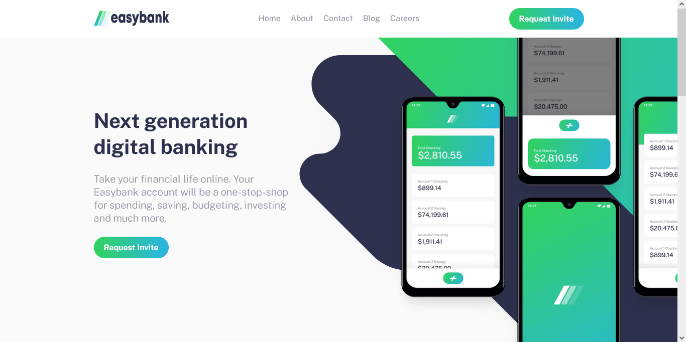
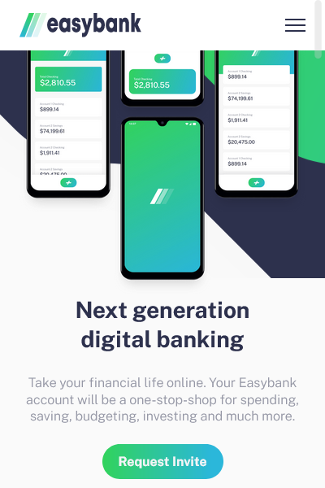

# Frontend Mentor - Easybank landing page solution

This is a solution to the [Easybank landing page challenge on Frontend Mentor](https://www.frontendmentor.io/challenges/easybank-landing-page-WaUhkoDN). Frontend Mentor challenges help you improve your coding skills by building realistic projects. 

## Table of contents

- [Overview](#overview)
  - [The challenge](#the-challenge)
  - [Screenshot](#screenshot)
  - [Links](#links)
- [My process](#my-process)
  - [Built with](#built-with)
  - [Useful resources](#useful-resources)
- [Author](#author)
- [Acknowledgments](#acknowledgments)

## Overview

### The challenge

Users should be able to:

- View the optimal layout for the site depending on their device's screen size
- See hover states for all interactive elements on the page

### Screenshot
#### desktop

#### mobile

### Links

- Solution URL: [frontend mentor](https://www.frontendmentor.io/solutions/responsive-landing-page-using-html-scss-and-javascript-ViussYi5T)
- Live Site URL: [github pages](https://khaled5321.github.io/easybank-landing-page/)

## My process

### Built with

- Semantic HTML5 markup
- scss
- Flexbox
- CSS Grid
- Mobile-first workflow
- javascript

### Useful resources

- [what media query breakpoints should you use](https://www.coder-coder.com/media-query-breakpoints/) - This is an amazing article which helped me understand breakpoints and how to use them.

## Author

- github - [@khaled5321](https://github.com/khaled5321)
- Frontend Mentor - [@khaled5321](https://www.frontendmentor.io/profile/khaled5321)
- Twitter - [@KhaledHaggag121](https://twitter.com/KhaledHaggag121)

## Acknowledgments

The [coder coder tutorial](https://www.youtube.com/watch?v=aoQ6S1a32j8&t=16238s) helped me in understaing mobile first approach and how to make the mobile menu.

